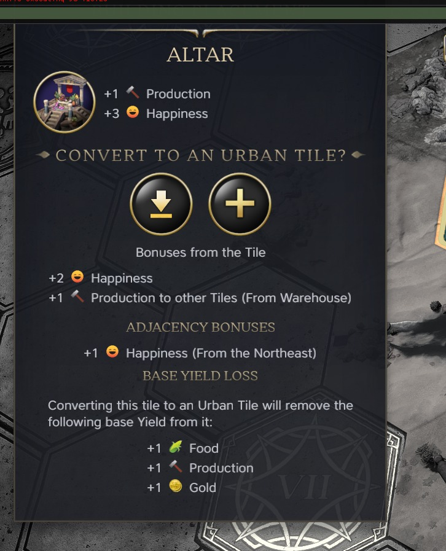

# Craimasjien's Mod Pack for Civilization VII

This pack is my on-going attempt to fix all the things I don't like about the vanilla Civilization VII experience. 
Feel free to request features and I will attempt to implement them as best I can.

## Features
- Added an overview of a tile’s base yields, which are lost when upgrading the tile to an urban district. This is especially useful when removing an existing rural improvement, such as a farm. 

## Roadmap / Wishlist
- Work in progress

## Abouts

### About me
I'm Bryan, a 33-year-old engineering manager at a SaaS company. Before transitioning into management, I worked as a developer, building mobile apps, web apps, and REST APIs. I still enjoy tinkering with code from time to time.

### About the mod
This mod was born out of my dissatisfaction with the state of the game at launch. A friend and I found ourselves frustrated by what seemed like minor oversights by Firaxis. When I discovered that the modding framework was built around HTML, CSS, and JavaScript, I realized I could probably fix the things I didn't like—and help the community in the process.