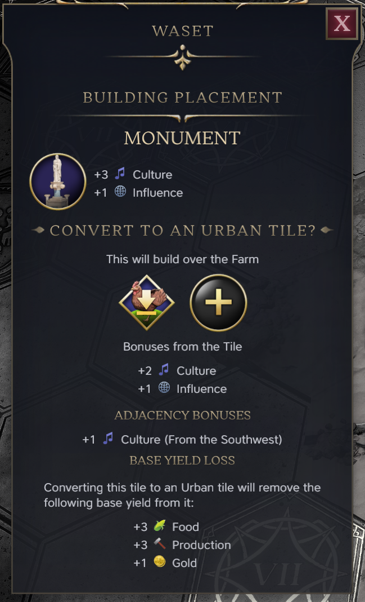
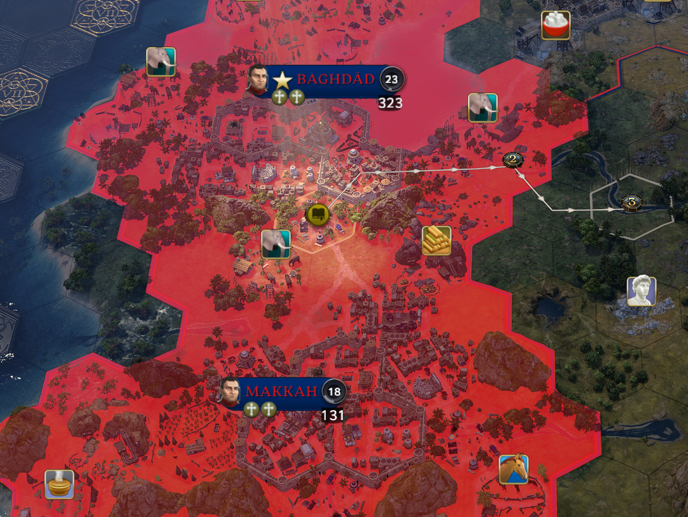
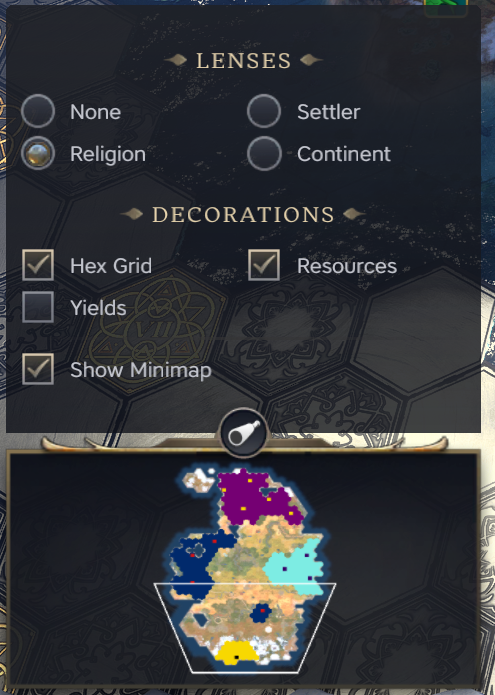

# Craimasjien's Mod Pack for Civilization VII

This pack is my on-going attempt to fix all the things I don't like about the vanilla Civilization VII experience. 
Feel free to request features and I will attempt to implement them as best I can.

## Features
- Added an overview of a tile’s base yields, which are lost when upgrading the tile to an urban district. This is especially useful when removing an existing rural improvement, such as a farm.
- A Religion lens, which shows you on the tiles which cities have been converted to a religion.

## Installation Instructions
1. Download the [latest release](https://github.com/craimasjien/civ7-craimasjiens-mod-pack/releases/latest)
2. Open the corresponding mods folder
    1. Windows: `%localappdata%\Firaxis Games\Sid Meier's Civilization VII\Mods`
    2. MacOS: `~/Library/Application Support/Civilization VII/Mods`
3. Extract the zip file and move the folder into the `Mods` folder.

## Roadmap / Wishlist
- Religion lens improvements
  - Like the on Continents layer, I want to show a panel of the available religions (a legend) and their corresponding colors, so it's easier to recognize the religion.

## Screenshots

## Abouts

### About me
I'm Bryan, a 33-year-old engineering manager at a SaaS company. Before transitioning into management, I worked as a developer, building mobile apps, web apps, and REST APIs. I still enjoy tinkering with code from time to time.

### About the mod
This mod was born out of my dissatisfaction with the state of the game at launch. A friend and I found ourselves frustrated by what seemed like minor oversights by Firaxis. When I discovered that the modding framework was built around HTML, CSS, and JavaScript, I realized I could probably fix the things I didn't like—and help the community in the process.